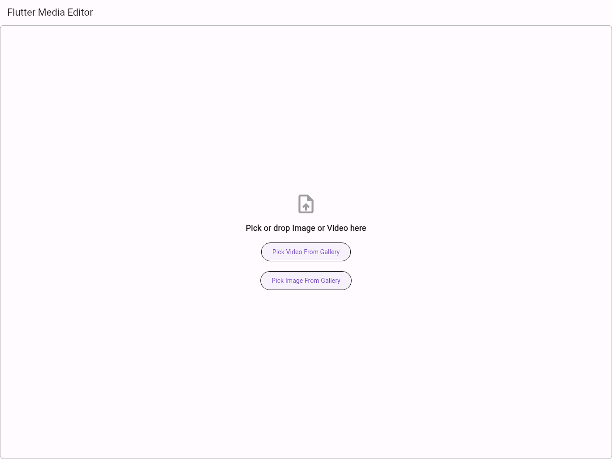

# media_editor

## Overview

This Flutter application is a versatile tool for image editing, designed to offer a user-friendly interface for manipulating images. Whether you're a professional looking to quickly edit images on the go, or a hobbyist wanting to play with your photos, this app provides essential features to get the job done.

The image editing UI and basic logic is derived from the package `extended_image` and its examples, which can be found at [extended_image package on pub.dev](https://pub.dev/packages/extended_image).

## Features

### Done
- **Image Editing**: Intuitive tools for enhancing your images.
  - **Cropping**: Easily crop images to your preferred size.
  - **Rotation**: Adjust the orientation of your images with simple rotation tools.
  - **Exporting**: Ability to export images in various formats for different use cases.

### To-Do
- **Video Editing**: Future updates will introduce video editing capabilities, expanding the versatility of the app.

## Screenshots

Below are some screenshots of the app in action. These images showcase the application's interface on different devices:

| Description       | Desktop View                                      | Phone View                                        |
|-------------------|---------------------------------------------------|---------------------------------------------------|
| **Main Interface**|  |  |

## Getting Started

To get started with this app, clone the repository and build the project in your Flutter environment. The application is easy to set up and requires minimal configuration.

## Contribution

Contributions to this project are welcome. Whether it's improving existing features or suggesting new ones, feel free to open an issue or submit a pull request.

## License

This project is licensed under the [MIT License](LICENSE).
